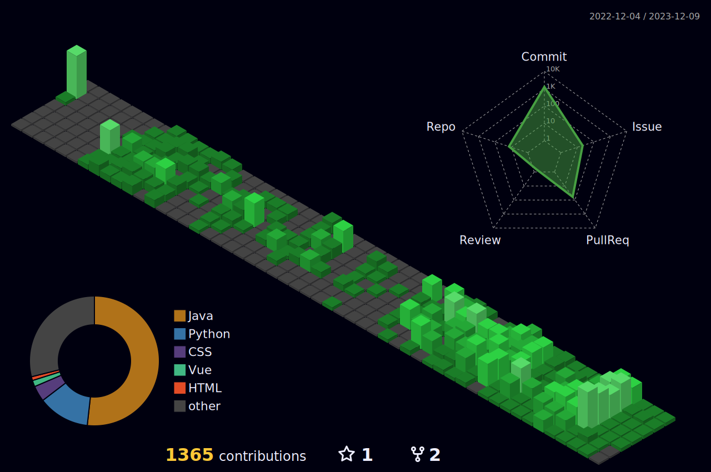

 
 

 
  
<h3 align="center">📫 Email : gudtjr2949@naver.com📫</h3>
  
 
 

 
 
  
<h3 align="center">📚 Tech Stack 📚</h3>
 

  </a>&nbsp
  </a>&nbsp 
  </a>&nbsp 
   
   
  &nbsp 
  &nbsp 
  
   
   
  </a>&nbsp 
   
   
  </a>&nbsp 
  </a>&nbsp
  </a>&nbsp
  &nbsp

   
   
  </a>&nbsp 
   
   
  &nbsp
  &nbsp
   
   
  &nbsp
  &nbsp

 

---

 

<h3 align="center">💻 Project 💻</h3>
 
<h3 align="center"><a href="https://github.com/gudtjr2949/Youtube_Comment_Analysis-NLP">유튜브 크리에이터를 위한 유튜브 댓글 분석 서비스</a></h3>
<h3 align="center"><a href="https://github.com/gudtjr2949/pass_final">Just a Moment (세계여행 플래너)</a></h3>
<h3 align="center"><a href="https://github.com/gudtjr2949/I-DEV-U">I DEV U (개발자 매칭 서비스)</a></h3>
<h3 align="center"><a href="https://github.com/gudtjr2949/Meditation_Diary">심신수양록</a></h3>
 

---

